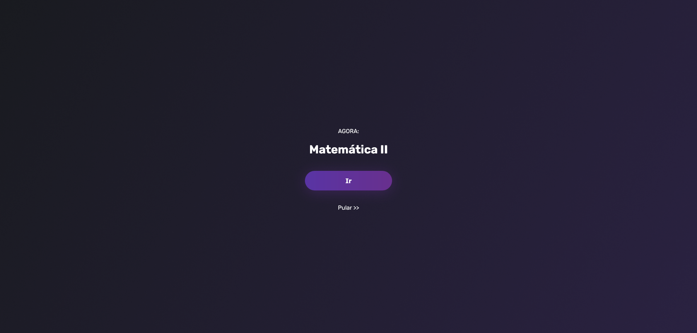

# Remote Classes

Remote classes is my first code. With the adoption of distance learning, I built a web application, learning JavaScript, to organize and centralize access to classes in a simple and fast way. Thus, it was enough to access it and be directed to the class that was happening at that moment.

## Screenshots

_Designed to be user friendly and clean. All you have to do is click (touch) the button._

## Stack

- HTML;
- CSS;
- JS.

## Next steps

- [ ] Implement clean code;
- [ ] Implement good practices;
- [ ] Separate front and back-end.

## License

MIT by [Wolney Oliveira](https://github.com/wolney-fo)
